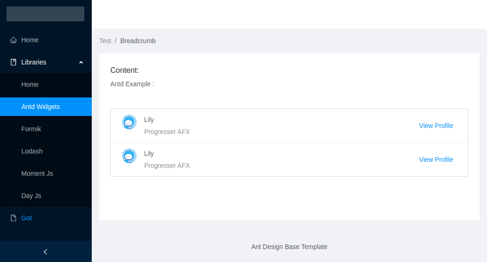
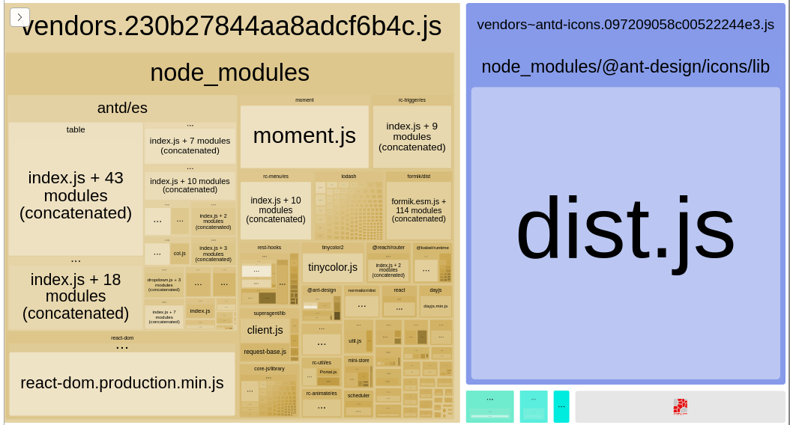

# Shiny Typescript Boilerplate

 []()
  
 


#### My own strong opinionated react/typescript boilerplate with blackjack and hookers. In fact, forget the boilerplate.


Main Features
>
- Async loader for routing and code 
- Only Functional component with Hooks
- State management with unstated-next 

Key Techs
> 
 -  [TypeScript](https://www.typescriptlang.org/) ([babel compilation](https://babeljs.io/docs/en/babel-preset-typescript)) 
 -  [React](https://reactjs.org/) (with [hooks](https://reactjs.org/docs/hooks-intro.html))
 -   [Webpack](https://webpack.js.org/)
 -  [Ant Design](https://ant.design)
 -  [Storybook](https://storybook.js.org/)
 -  [Sass](https://sass-lang.com/)
 
 Other libraries installed
> 
- [Reach Router](https://reach.tech/router)
- [Day.js](https://github.com/iamkun/dayjs)
- [Moment.js](https://momentjs.com/) 
- [Rest Hooks](https://resthooks.io/)
- [Unstated Next](https://github.com/jamiebuilds/unstated-next)
- [Formik](https://jaredpalmer.com/formik/) 

Typescript extended support with:
> 
- [TSLint](https://palantir.github.io/tslint/)  (TODO: change for eslint-typescript when is ready)
	- [SonarTS](https://github.com/SonarSource/SonarTS)
	- [tslint-react](https://github.com/palantir/tslint-react)
	- [TSLint Config Airbnb](https://github.com/progre/tslint-config-airbnb/#readme)
	- [tslint-clean-code](https://github.com/Glavin001/tslint-clean-code)
- [type-coverage](https://github.com/plantain-00/type-coverage#readme)
- [ts-toolbelt](https://github.com/pirix-gh/ts-toolbelt) 


StoryBook extended support with:
> 
- [Storybook Addon Actions](https://github.com/storybookjs/storybook/tree/master/addons/actions)
- [Storybook Info Addon](https://github.com/storybookjs/storybook/tree/master/addons/info)
- [Story Links Addon](https://github.com/storybookjs/storybook/tree/master/addons/links)
- [Storybook Storysource Addon](https://github.com/storybookjs/storybook/tree/master/addons/storysource)
- [Props Combinations addon](https://github.com/evgenykochetkov/react-storybook-addon-props-combinations)
- [react-docgen-typescript-loader](https://github.com/strothj/react-docgen-typescript-loader)


Webpack Extended support with:
>
- [babel-plugin-lodash](https://github.com/lodash/babel-plugin-lodash)
- [babel-plugin-import](https://github.com/ant-design/babel-plugin-import)
- [moment-locales-webpack-plugin](https://github.com/iamakulov/moment-locales-webpack-plugin)
- [ webpack-ant-icon-loader](https://github.com/Beven91/webpack-ant-icon-loader)
- [Webpack Bundle Analyzer](https://github.com/webpack-contrib/webpack-bundle-analyzer)
- [critters-webpack-plugin](https://github.com/GoogleChromeLabs/critters) 


##### Vs code recommended extencions
>
- [EditorConfig for VS Code](https://marketplace.visualstudio.com/items?itemName=EditorConfig.EditorConfig)
- [TSLint](https://marketplace.visualstudio.com/items?itemName=ms-vscode.vscode-typescript-tslint-plugin)
- [JSON to TS](https://marketplace.visualstudio.com/items?itemName=MariusAlchimavicius.json-to-ts) 


## Installation

Install it:

```sh
git clone https://github.com/emilianox/shiny-typescript-boilerplate
npm install
```

## Starting the development server

```shell
npm start
```

## Screenshots
> Main Page
 
 

> Analize Page

 


## NPM Tasks

```shell
npm run storybook # run storybook
npm run type-check # run tsc to check ts errors
npm run type-check:watch # run tsc to check ts errors in watch mode
npm run type-coverage # run type-coverage
npm run build # compile project
npm run analize-build # compile project and run Bundle Analyzer
npm run build-storybook # run storybook in production and static mode
npm run clean # clean dist/ folder
```


### API used
https://anapioficeandfire.com/

### Maintainers
[@emilianox](https://github.com/emilianox).

### Contributing
Feel free to dive in! [Open an issue](https://github.com/emilianox/shiny-typescript-boilerplate/issues/new)  or submit PRs.

#### This is a heavy edited fork of:
https://github.com/a-tarasyuk/react-webpack-typescript-babel

#### Licence
**MIT**